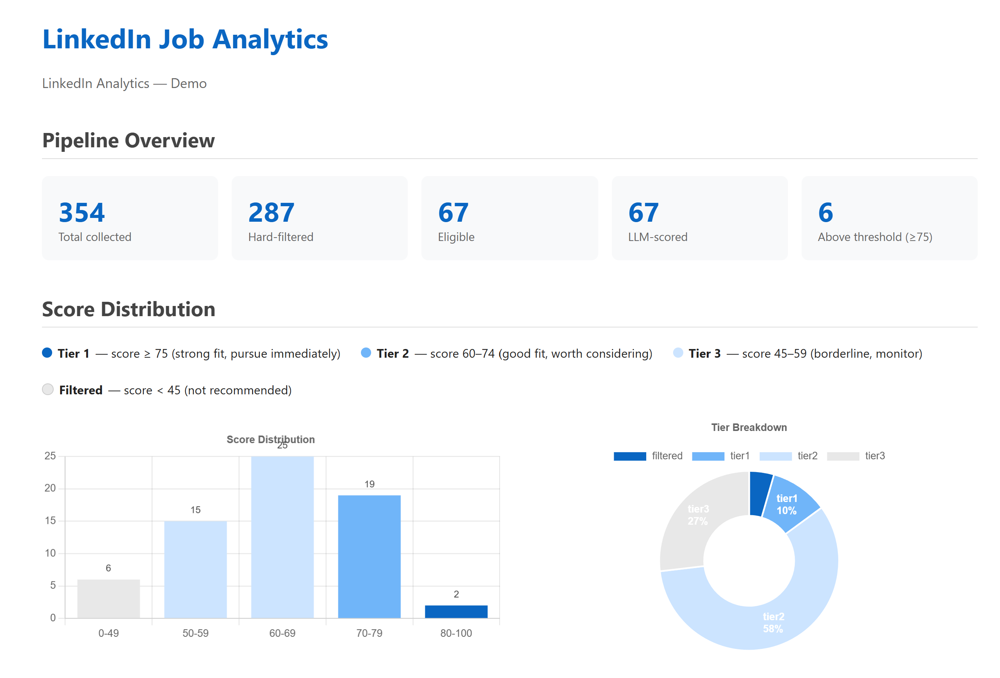
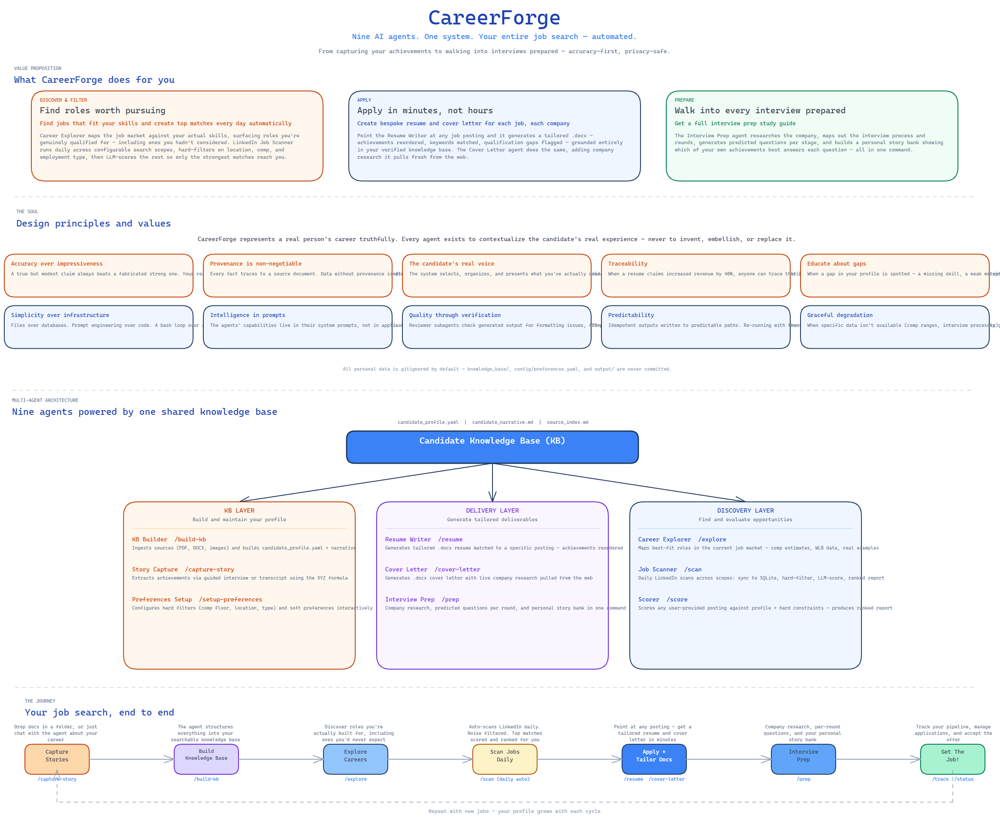

# CareerForge

Job searching manually is slow, inconsistent, and doesn't scale. CareerForge is a personal AI job search system powered by Claude Code. It automates the full search lifecycle — daily LinkedIn discovery with hard-filtering and LLM scoring, tailored resumes and cover letters generated in minutes, and deep interview preparation including company research and a personal story bank — all grounded in your verified career profile.

---

## Step 0 — Install Claude Desktop (everyone)

Download and install the Claude Desktop app from **https://claude.com/download**. This gives you access to Claude Code, which CareerForge runs inside.

> **Claude.ai Projects (Cowork) is not supported.** Cowork cannot execute scripts, access the filesystem, or generate files — none of CareerForge's core features work there. You must use Claude Code, which is available inside the Claude Desktop app.

---

## You are a non-technical user (Claude Desktop only)

No terminal required. Everything runs inside the Claude Desktop app.

### Primary path — Install via Marketplace

1. Open Claude Desktop and start a Claude Code session
2. Create an empty folder anywhere on your computer (e.g. `My Job Search`)
3. Open that folder in Claude Code
4. Run these two commands:
   ```
   /plugin marketplace add https://raw.githubusercontent.com/michaelgarcia/careerforge/refs/heads/main/marketplace.json
   /plugin install careerforge@careerforge
   ```
5. Run `/cf-init` — CareerForge will scaffold your workspace and install Python dependencies
6. Say **"I'm ready to get started"** to begin building your profile

> **Scope note:** Plugin installation is user-global — agents and commands become available in every Claude Code session on your machine. To keep it scoped to one folder, use the technical path below instead.

### Backup path — Install via ZIP upload

Use this if the marketplace command doesn't work.

1. Download the latest `careerforge-x.x.x.zip` from [GitHub Releases](https://github.com/michaelgarcia/careerforge/releases)
2. In Claude Code, run: `/plugin add /path/to/careerforge-x.x.x.zip`
   (Or use the **Upload Plugin** button in the Claude Desktop UI)
3. Continue from step 5 above (`/cf-init`)

---

## You are a technical user (Claude Code and Terminal)

Starting point: Claude Desktop installed (Step 0), nothing else required.

### Step 1 — Get the repo

**Option A — Git clone (preferred):**
```bash
git clone https://github.com/michaelgarcia/careerforge.git my-job-search
cd my-job-search
```

**Option B — No Git installed yet:**
Download the ZIP from https://github.com/michaelgarcia/careerforge/archive/refs/heads/main.zip, unzip it, and `cd` into the folder. Then run the setup script — it will install Git for you.

### Step 2 — Run the setup script

The setup script installs Git, Python 3.11+, and all Python packages. It prints the result of each step clearly and gives you a manual fallback URL if anything fails.

**Windows** (PowerShell):
```powershell
powershell -ExecutionPolicy Bypass -File scripts\setup_windows.ps1
```

**Mac/Linux** (Bash):
```bash
chmod +x scripts/setup_mac.sh
./scripts/setup_mac.sh
```

The script will show `[OK]`, `[INSTALLED]`, or `[FAILED]` for each step with instructions to resolve any failures manually.

### Step 3 — Launch CareerForge

**Windows:**
```
scripts\launch_windows.bat
```

**Mac:**
```bash
./scripts/launch_mac.command
```

Both scripts open Claude Code in the repo root. Say **"I'm ready to get started"** to begin onboarding.

---

## First-time setup (after installation)

Once Claude Code opens, say:

> **"I'm ready to get started"**

CareerForge will walk you through building your profile from your resume and career documents, setting up your job search filters, and running your first scan — all in one conversation.

After setup, talk to CareerForge in plain English:

- *"Find me jobs in machine learning"*
- *"I want to apply to [paste URL]"*
- *"I have an interview at AnyCompany next week"*
- *"What's my application status?"*

---

## What it looks like in practice



*354 jobs collected across 5 search scopes → 287 hard-filtered → 67 LLM-scored → **6 top matches surfaced automatically***

---

## Architecture



---

## Slash Commands

| Command | What it does |
|---------|-------------|
| `/build-kb` | Ingest all sources in `knowledge_base/sources/` and build your profile |
| `/setup-preferences` | Configure job search filters interactively or from free-form text |
| `/capture-story [transcript]` | Capture a new achievement (interactive or extraction mode) |
| `/resume [URL]` | Generate a tailored resume for a job posting |
| `/cover-letter [URL]` | Generate a tailored cover letter for a job posting |
| `/score [URL]` | Score a job posting against your profile and preferences |
| `/prep [URL]` | Full interview prep pipeline (company research, questions, story bank) |
| `/track [update]` | Update the application tracker (e.g. "I submitted to Stripe") |
| `/status` | Overview of your job search pipeline, grouped by status |
| `/scan [--bootstrap]` | Run the LinkedIn scanner: sync, filter, score, and report top matches |
| `/explore` | Discover best-fit roles from your profile across the current job market |
| `/analytics` | Generate an interactive HTML analytics dashboard from the jobs database |

---

## Design Principles

**Files over databases.** At this scale (one candidate, hundreds of job postings), structured files on disk beat a database every time.

**Prompt engineering over code.** The agents' intelligence lives in their system prompts. Invest time in prompt refinement — orchestration code should be minimal glue.

**Source provenance.** The KB builder tracks where every fact came from. When a resume claims "increased revenue by 40%," you can trace it to the source document.

**Keep it simple.** Resist adding infrastructure or dependencies unless the benefit is clear and immediate. Complexity is a cost — pay it only when you must.

---

## Updating

**Technical users:**
```bash
git pull
```
Re-run the setup script if release notes mention new dependencies (rare).

**Non-technical users:**
```
/plugin update careerforge
```
This refreshes agents and commands. The `scripts/` and `tools/` directories (Python scripts for docx and LinkedIn scanning) are not touched by a plugin update — they only need refreshing if a release note explicitly says so, in which case delete your `scripts/` and `tools/` folders and re-run `/cf-init`.

---

## Release a new plugin version

To regenerate the distributable ZIP after making changes:

```bash
python scripts/create_plugin_zip.py
```

Output: `careerforge-{version}.zip` in the repo root, ready for upload or release attachment.
